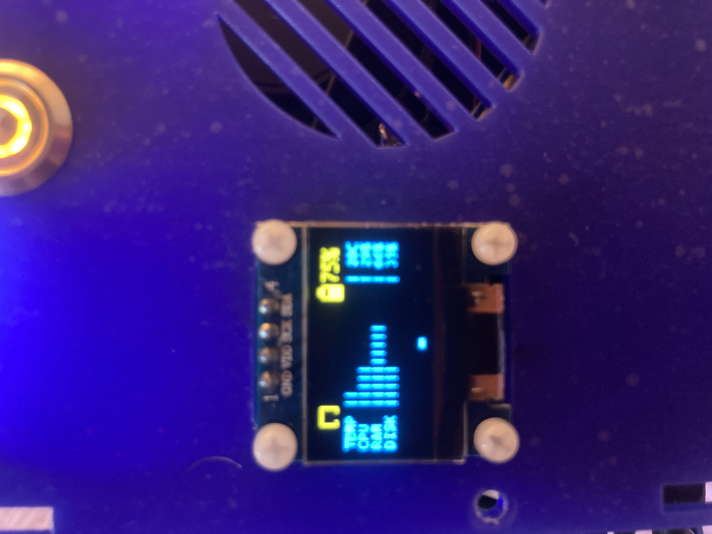
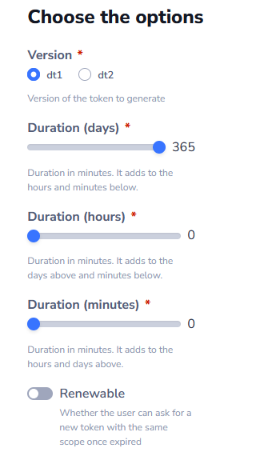

## Issues Encountered

### Outdated Documentation.

#### Learning Exercise Videos outdated
[Learning Exercise Video link at time of writing](https://docs.duckietown.com/daffy/opmanual-duckiebot/lx/supported/general_running_lx.html)

Video at that link seems to have different file/dir structure than the exercises I got.

This is my file structure, clearly missing a `template_ros` directory.

#### Incorrect wiring configuration for Duckiebot display

Following the assembly instructions for Duckiebot DB21J the camera wiring is incorrect and my display would never display.

[Link to documentation at time of writing](https://docs.duckietown.com/daffy/opmanual-duckiebot/assembly/db21j/index.html#top-deck-assembly)

The correct wiring below:

Black - Red - Yellow - Blue

#### Confusing camera wiring illustration (Bend needed)

The ribbon cable you get in the kit does not have the blue ends on one side as shown in the image.

In practice you **must** twist the ribbon cable to have the blue end in the correct orientation for both connections.

### Duckiebot Connectivity Issues

The Duckiebot would become unresponsive to pings and commands randomly for a short period of time. But for example the camera image would still be updated continously in the dashboard.

### Confusing Learning Exercises

Never used jupyter notebooks and found it confusing on where to write code and how to execute it... More so a reason why it took much longer than expected to get through the first exercise.

### Missing Components Errors

Shows unhealthy components although the ToF sensor works and everything is conected as per instructions. There just seemingly is no solution to this at time of writing.

### Display changed | to # after dts duckiebot update

The display used `|` to indicate cpu usage etc. but after the update it uses `#`. There seems to be no fix at time of writing. Other people mention it in stack overflow.

### Flashing lights

Possibly related to the constant connectivity issues? Lights turn off briefly and switch back on when nothing else is going on with the duckiebot.

### Missed generated Token

The token gets generated at the bottom of the webpage. I fully expected a pop up with the generated token. Initially though the token was not being generated at all.

### Documentation contradiction/confusion

When running a dts command to add my token it tells me it should look something like "dt2-..." this tells me I need a dt2 token. But in the documentation it says the token should look like "dt1-...".

Also because of this, I ended up using a dt2 token but it turns out there are issues with using the dt2 token.

In general there are little things in Duckietown that have been missed. Like the hints when generating a token all say they refer to minutes.

### Unable to create a duckietown account

I **HAD** to use my github account to create a Duckietown account.

If you don't already have a github account, it might be a good idea to set one up now.

### Connection Issues

## General Things

**Small community**
Lack of youtube videos for tutorials covering assembly, learning exercises and more...

Limited support in stack overflow and slack. Support will come but might take a while...

