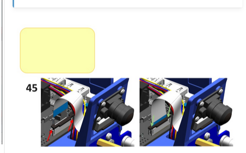
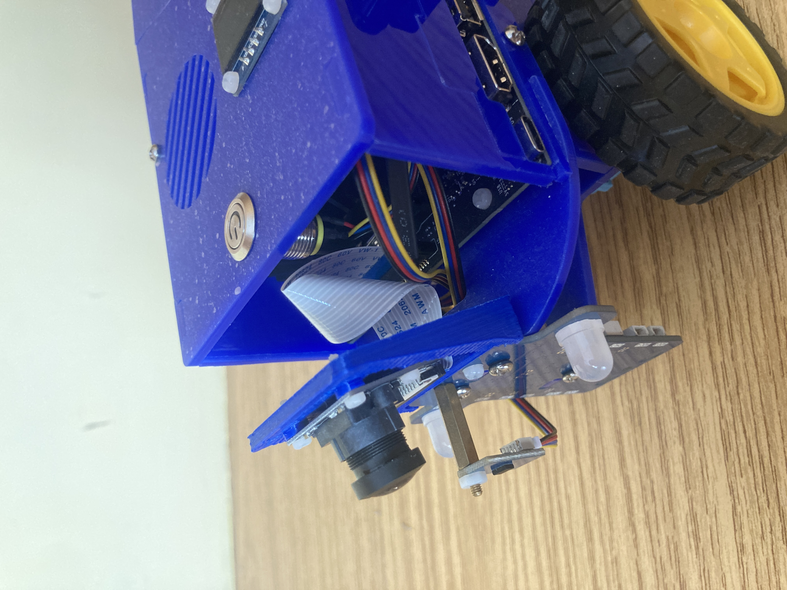
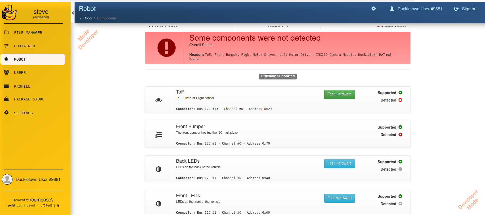

# WIKI

## Creating Duckietown Account

I had to use my GitHub account to sign up on the Duckietown website. It would not let me sign up normally.

[Duckietown Sign Up](https://hub.duckietown.com/signup/)

## Use DT1 Token

Make sure to use a DT1 Token. This seems to prevent issues with certain features and has been recommended in Slack/Stackoverflow. This may have fixed my issue with running simulations in th learning exercises.

The new token is generated at the bottom of the webpage.

## Correct Display Wiring

[Link to documentation at time of writing](https://docs.duckietown.com/daffy/opmanual-duckiebot/assembly/db21j/index.html#top-deck-assembly)

The display wiring instructions seem to be incorrect/outdated and did not work for me.

My Duckiebot Model: DB21M (2GB Jetson Nano)

The correct wiring below:

`Black - Red - Yellow - Blue`

## Note on Camera Wiring

You may have to twist the ribbon cable to have the blue end in the correct orientation for both connections.

## Issues you can ignore

### Display changes | -> \#

Doesn't seem to impact usability.

### Missing component message + red lights

Doesn't seem to impact usability in my case. Do check that all components work through `Test Hardware`

## General Tips

### Don't charge battery from laptop USB

I recommend charging from a wall outlet. The laptop USB may be too weak to charge the Duckiebot battery, even if left charging for a long time.

### Use provided instructions, read carefully and take your time

Even if parts can be outdated, this is the best resource to get started with Duckiebots. Take your time and read all instructions carefully to make sure you do not miss critical steps.

### Use the provided course

Utilize the online course. Again this is the best source to get familiar with the Duckiebot and Duckietown environment in an organized manner. This course makes use of the learning exercises present in the documentation.

[Learning Exercises](https://docs.duckietown.com/daffy/instructor-manual/resources/exercises/index.html)

[Course Link](https://www.edx.org/learn/technology/eth-zurich-self-driving-cars-with-duckietown)

### Use Stackoverflow/Slack

Stackoverflow and Slack provide you with a way to ask questions about issues you cannot solve, or find existing issues with potential solutions. Very useful, and because the community is quite small there isn't really any other place to find help.

[Stackoverflow](https://stackoverflowteams.com/c/duckietown/questions)

[Contact Page](https://duckietown.com/contact/)

### Find out what model your Duckiebot is

[Duckiebot Configurations](https://docs.duckietown.com/daffy/opmanual-duckiebot/preliminaries_hardware/duckiebot_configurations/index.html)

